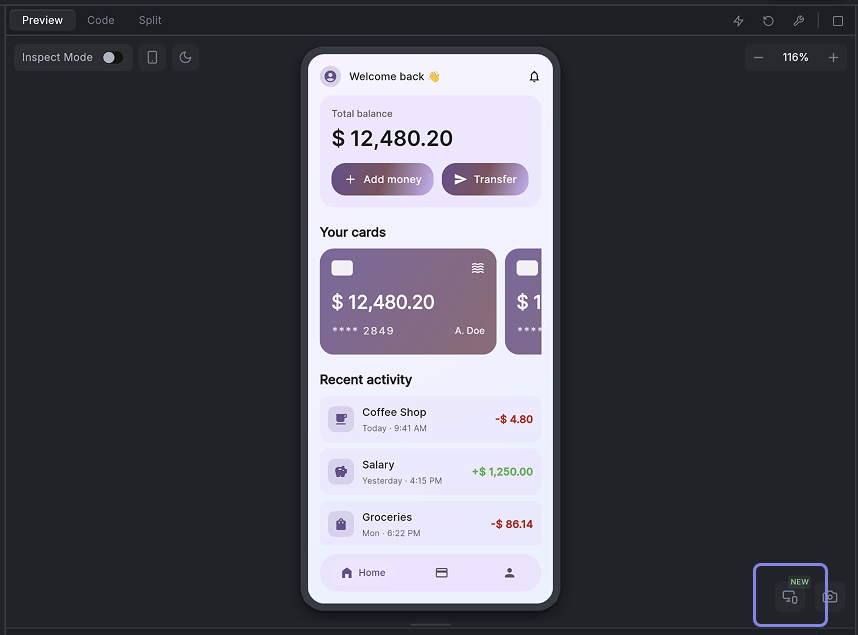

# Testing App on Mobile Devices
Testing your app on real phones and tablets helps you make sure it looks and behaves exactly as your users will experience it. Dreamflow offers two main ways to test:

1. **Live Preview on Your Mobile Device**
- Great for quickly trying out changes as you build in Dreamflow.
- Instantly updates as you make edits.
- Runs in your mobile browser, so it won’t test device-specific features like push notifications, camera access, location services, or in-app purchases.

2. **Download and Run the App on Your Device**
- Best for testing how your app behaves as a real iOS or Android app.
- Lets you verify that features tied to the device’s operating system—such as notifications, camera, file storage, or app permissions—work properly.
- Requires some setup; you’ll need to download, build, and install the app each time you want to test new changes.

:::info[Prerequisites]
Downloading the code is only available with a [**paid subscription**](https://dreamflow.app/pricing).
:::

## Using the Live Preview on Your Mobile Device

In Dreamflow you can use the device icon button in the bottom right corner of the canvas to pull up a QR code for accessing the preview on your mobile device. 



When you scan the QR code or open the preview link on your phone, here’s what to keep in mind:

- **For testing only**: The mobile preview is meant for testing your app as you build. It’s not intended for sharing with others or hosting your live app.
- **Real-time updates**: Any change you make in Dreamflow will instantly appear in the mobile preview, just like in the builder preview.
- **Persistent link**: The QR code and preview link stay the same for your project, so you can reuse them. However, the preview will only load when your project is open and running in Dreamflow.
- **Session limit**:  You can have up to 5 preview sessions open at once. Each open browser tab or connected device counts as one session.
- **Preview controlled through Dreamflow Project**: You must have your project open and running Dreamflow to use the mobile preview. If you close your Dreamflow project, the preview will stop working until you reopen it. The preview controls like hot reload, hot restart and stop also control the preview on your mobile device. 
- **Browser-based**: The preview runs in your mobile browser. It’s great for checking layout, user interactions and functionality but won’t test features that rely on the actual app installation (like push notifications, camera access, or offline storage).

:::warning[reminder]

You must have your project open and running Dreamflow to use the mobile preview. 

:::

### Installing the Preview as a PWA

You can also install your app on your phone or tablet as a Progressive Web App (PWA). This lets you open it directly from your home screen—just like a regular mobile app.

#### Why install as a PWA?

Installing as a PWA is helpful when you want to:

- **Experience your app like a real mobile app**: It opens in full-screen mode without the browser interface (no address bar or tabs).

- **Quickly access your app**: You can launch it with a single tap from your home screen. Note that your project will need to be open and running in Dreamflow for the PWA to load. The quick access still allows you to rapidly pull up the preview without needing to scan the QR code again.


:::note
A PWA still runs in your browser under the hood, so it won’t support native device features like push notifications, camera, or local file access. To test those, you’ll need to run the actual iOS or Android build as mentioned below.
:::

#### How to install PWA

**On iOS**

1. Open the preview link or scan the QR code in **Safari**
2. Tap the Share icon (the square with an arrow).
3. Select Add to Home Screen.
4. Optionally modify the name for your app and tap **Add**.
5. The app will appear on your home screen and open in full screen when tapped.

:::note
Other browsers on iOS (like Chrome or Edge) may work, but for the most reliable experience use Safari.
:::

**On Android**

1. Open the preview link or scan the QR code using your mobile browser.
2. When prompted, tap **Install App** or **Add to Home Screen**.
    - If you don’t see a prompt, open the browser menu (⋮) and select **Add to Home Screen.**
4. Optionally modify the name for your app and confirm.
5. The app will appear on your home screen and can be opened like any other app.


## Testing Natively on your Device

### Android Setup

To test your app on an Android device or emulator, you first need to set up your development environment, install Flutter, and configure your target device. Instructions for each platform are available here: [**Windows**](https://docs.flutter.dev/get-started/install/windows/mobile), [**Mac**](https://docs.flutter.dev/get-started/install/macos/mobile-android), [**Linux**](https://docs.flutter.dev/get-started/install/linux/android).

To setup an Android physical device, first enable Developer Options and USB Debugging in your Android device. Navigate to **Settings > About phone**, tap **Build number** seven times to activate Developer Options, then go to **Settings > System > Developer options** and enable **USB debugging**.

Connect your device to your computer via USB, authorizing the connection if prompted. Verify the setup by running `flutter devices` in Android Studio’s terminal; your device should appear in the list of connected devices.

:::info

For more detailed guidance, refer to the [**Android Flutter documentation**](https://docs.flutter.dev/get-started/install/windows/mobile#configure-your-target-android-device).

:::

### iOS Setup

For app testing on an iOS device or simulator, you need a Mac with Xcode installed. Follow [**these instructions**](https://docs.flutter.dev/get-started/install/macos/mobile-ios) to set up your Mac.

To setup a physical iOS device, you must configure your **Apple Developer account** and set up **code signing** in Xcode. First, add your **Apple ID** by opening **Xcode > Preferences > Accounts**, clicking **"+"**, selecting **Apple ID**, and signing in.

Next, assign your project to a development team. Open your project in Xcode, select the **Runner** project, go to **Signing & Capabilities**, and choose your **Apple Developer team** in the **Team** dropdown. If your team is not listed, ensure that your Apple ID has been properly added to Xcode.

Finally, configure code signing to allow your app to run on a real device. Ensure **"Automatically manage signing"** is enabled. Xcode will attempt to create and download a **provisioning profile** for your project. If issues arise, you may need to manually create a provisioning profile in the **Apple Developer Certificates, Identifiers & Profiles** section. Once created, download and double-click the provisioning profile to install it in Xcode.

:::info

For more detailed guidance, refer to the [**iOS Flutter documentation**](https://docs.flutter.dev/get-started/install/macos/mobile-ios#configure-your-target-ios-device).

:::

### Local Run

You can also Local Run your app on a real device using the Dreamflow Desktop App. Local Run automatically tracks changes in your project, downloads the code locally, and gives you the option to use Flutter's Hot Reload or Hot Restart to see your changes instantly on a device.

#### Using Local Run

Follow the steps below to run and test your app locally on a physical device or simulator:

1. From the bottom bar in the Dreamflow, click **Download Local Run**.
2. A dialog appears prompting you to download the app. Click **Download for macOS** to begin downloading.
3. After the download completes, open the downloaded file.
4. In the installer window, drag **Dreamflow Local Run** into the **Applications** folder.
5. Open the Applications folder and launch **Dreamflow Local Run**. The app runs as a menu bar application.
6. Return to the Dreamflow web app and click **Connect to Local Run**. When prompted, allow Dreamflow to open the Local Run app.
7. When the Local Run app launches, it automatically checks all required prerequisites, downloads the correct Flutter SDK, and fetches your project files, so no manual configuration is required.
8. Once setup is complete, a list of available devices and simulators appears, including the iOS Simulator, Android Emulator, and any connected physical devices. To begin, click the play (**▶**) button next to the simulator to start it. After the simulator is running, select it again and click the play button at the bottom to launch your app.
9. After the app starts on the selected device or simulator, the Local Run panel shows a running status. Any changes you make in Dreamflow are automatically hot reloaded on the connected device. Updates appear instantly without restarting the app, allowing you to iterate quickly and continuously refine your app in real time.

<div style={{
    position: 'relative',
    paddingBottom: 'calc(52.67989417989418% + 41px)', // Keeps the aspect ratio and additional padding
    height: 0,
    width: '100%'}}>
    <iframe 
        src="https://demo.arcade.software/wn51rJVwq9IZ6ZrHp50L?embed&show_copy_link=true"
        title=""
        style={{
            position: 'absolute',
            top: 0,
            left: 0,
            width: '100%',
            height: '100%',
            colorScheme: 'light'
        }}
        frameborder="0"
        loading="lazy"
        webkitAllowFullScreen
        mozAllowFullScreen
        allowFullScreen
        allow="clipboard-write">
    </iframe>
</div>
<p></p>

:::info

If you want the Local Run pop-up to stay visible, select **Keep Open** from the app menu. This keeps the Local Run window pinned so it doesn’t auto-dismiss when you click outside it.


:::

#### App Running Controls

- Run (▶): Builds and launches your app on the selected device or simulator.
- Hot Reload (⚡): Applies most code and UI changes without restarting the app, preserving current state whenever possible.
- Hot Restart (↻): Restarts the Dart isolate and rebuilds the app more fully than Hot Reload. App state is reset, but it is faster than a full stop and run.
- Stop (■): Stops the currently running app on the selected device or simulator.


#### Open Flutter DevTools

To open Flutter DevTools, click the magnifying glass icon in the bottom bar of the Local Run app. This launches Flutter DevTools in your browser for the currently running session. You can inspect widget tree, view performance timelines, debug layout, track memory, and review network activity. If DevTools does not open, start the app first (▶), then try again. DevTools typically requires an active run session.


#### View Logs

Opens the Local Run logs so you can troubleshoot issues such as setup failures, build errors, device connection problems, and run-time crashes.


#### More Settings

- **Show Flutter Doctor**: Opens Flutter Doctor output so you can see whether your local Flutter tooling is healthy (for example, Flutter SDK, Xcode tooling, Android tooling, and any missing dependencies). If there are any issues, you can directly resolve them from the app itsleft.

<div style={{
    position: 'relative',
    paddingBottom: 'calc(52.67989417989418% + 41px)', // Keeps the aspect ratio and additional padding
    height: 0,
    width: '100%'}}>
    <iframe 
        src="https://demo.arcade.software/fW0LglEgNkhoEJCVHJnW?embed&show_copy_link=true"
        title=""
        style={{
            position: 'absolute',
            top: 0,
            left: 0,
            width: '100%',
            height: '100%',
            colorScheme: 'light'
        }}
        frameborder="0"
        loading="lazy"
        webkitAllowFullScreen
        mozAllowFullScreen
        allowFullScreen
        allow="clipboard-write">
    </iframe>
</div>
<p></p>

- **Start/Close iOS Simulator**: Launch and close the currently running iOS Simulator instance.
- **Start/Close Android Emulator**: Launch and close the Android Emulator.
- **Open Project in Xcode**: Opens the iOS workspace for your project in Xcode so you can manage iOS-specific settings, signing, capabilities, and native configuration.
- **Check iOS Config**: Runs an iOS-specific configuration check to help identify common setup issues (for example, Xcode command line tools, CocoaPods, signing, and simulator readiness).
- **Check Android Config**: Runs an Android-specific configuration check to help identify common setup issues (for example, Android SDK setup, emulator readiness, and required tooling).
- **Clean Local Storage**: Clears Local Run’s cached local data (such as Dreamflow project files) to resolve issues caused by stale or corrupted cache.
- **Check for Updates**: Checks whether a newer version of the Local Run app is available and prompts you to update if needed.
- **Quit**: Exits the Local Run app.

### Download Code and Run

To download your app code, click on your project name and select the **Download Code** option.


Once downloaded, open the project in your preferred IDE and run your app on either a real device or an emulator by following the instructions below:

- For **VS Code**:
    1. Go to the **View** menu > select **Terminal** from the dropdown.
    2. Run the command `flutter pub get`.
    3. Now, enter the command `flutter run`. VS Code will build and run your app. You'll see the output in the terminal, and the app should launch in the selected emulator or physical device.
- For **Android Studio**:
    1. Open the terminal within Android Studio by clicking **View** > **Tool Windows** > **Terminal**.
    2. Run the command `flutter pub get`.
    3. Click the green "Run" button (a right-facing triangle) located in the top toolbar. Choose the target device (emulator or physical device) where you want to run the app. Android Studio will build and run your app. You'll see the output in the "Run" panel at the bottom, and the app should launch in the selected emulator or device.

:::info
If you encounter a version compatibility issue with Flutter, you can resolve it by upgrading to the latest version. Simply execute the `flutter upgrade` command in your terminal. To verify your current Flutter version, use the `flutter --version` command.
:::

### Building APK File

You can build APK files locally to test your app on Android devices or prepare it for release on the Google Play Store.

:::info[Prerequisites]

Before building an APK, make sure your [**Android setup**](#android-setup) is complete and the [**app runs**](#download-code-and-run) successfully.

:::

#### Building a Debug APK (for Local Testing)

Debug APKs are useful for quickly installing your app on a device without signing or optimization. To build a debug APK:

1. Open a terminal in your project root.
2. Run the following command.
    ```jsx
    flutter build apk --debug
    ```
    
3. The APK will be generated at:
    
    ```jsx
    build/app/outputs/flutter-apk/app-debug.apk
    ```
    
4. Now, you can either directly install it on your device:
    
    ```jsx
    flutter install
    ```
    or manually copy the APK to any device and install it.
    

:::warning

Debug APKs are not optimized and should not be uploaded to the Play Store.

:::

**Build App for Release**

Dreamflow lets you [deploy apps directly to the Google Play Store](../publish/google-playstore-deployment.md) from within the platform. If you prefer to publish manually, you’ll first need to **sign your app** with a keystore and then **build a release APK or App Bundle**. Release builds are fully optimized, securely signed, and ready for distribution on the Play Store.

You can follow the official Flutter documentation for detailed steps:

- [Sign the app](https://docs.flutter.dev/deployment/android#sign-the-app)
- [Build the app for release](https://docs.flutter.dev/deployment/android#build-the-app-for-release)

### Building IPA File

You can’t generate a debug `.ipa` file. Debug builds are only for local development and testing, and once your [iOS setup](#ios-setup) is complete, you can [run](#download-code-and-run) them directly on your device.

**Build App for Release**

Dreamflow lets you [deploy apps directly to the App Store](../publish/apple-app-store-deployment.md) from within the platform. If you prefer to create an IPA file for manual distribution (e.g., via TestFlight or the App Store), you’ll need to build a release IPA. This requires proper **code signing** with your Apple Developer account. Follow the official guide for detailed steps on [build and release for iOS](https://docs.flutter.dev/deployment/ios).