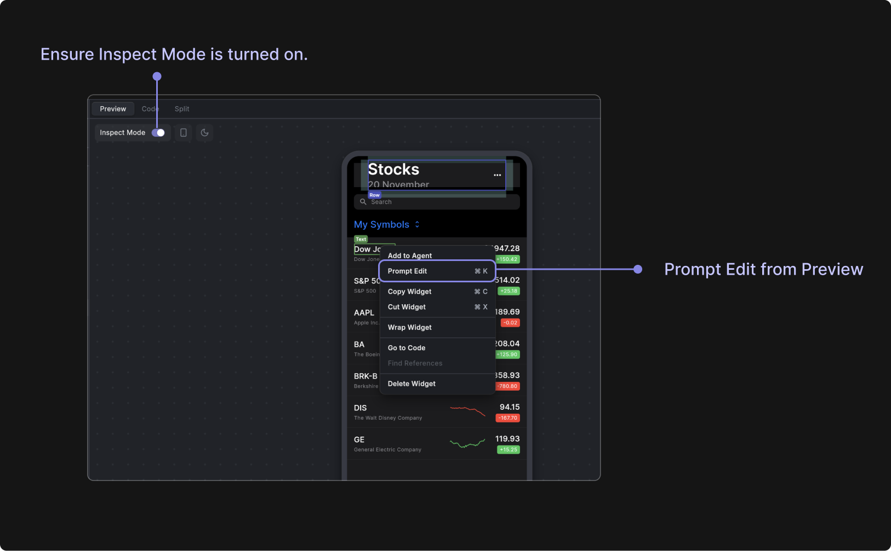

# Agent Panel

The Agent Panel is an AI-powered development assistant that helps you build and modify your Flutter app through natural language conversations. Simply describe what you want to create or change, and the AI will help you implement it.

To access the agent chat, click on the Agent Panel button in the right sidebar to open the chat interface. Type your request in the message box at the bottom. For example:

- *"Add a blue button that says 'Submit'"*
- *"Create a login form with email and password fields"*
- *"Make the text larger and change the color to red"*

    <iframe 
        src="https://demo.arcade.software/Xj4dOa9cBRVeLkIHq1vH?embed&show_copy_link=true"
        title=""
        style={{
            position: 'absolute',
            top: 0,
            left: 0,
            width: '100%',
            height: '100%',
            colorScheme: 'light'
        }}
        frameborder="0"
        loading="lazy"
        webkitAllowFullScreen
        mozAllowFullScreen
        allowFullScreen
        allow="clipboard-write">
    </iframe>

## Agent Context

The Agent Panel automatically understands your current project context, but you can provide additional information to help the AI give you more accurate and relevant assistance.

The AI automatically has access to:
- Your current app's code and structure
- The widget you currently have selected
- Recent changes you've made
- Your project's dependencies and configuration

### Image Attachments

Use the Attach Image button in the message box to add screenshots or images to your conversation. This can help the AI understand:

- Visual designs or mockups you want to implement
- Current state of your app for reference
- Specific UI elements you want to modify
- Before/after comparisons for changes

### Screenshot Mode

Instead of trying to describe your current app's appearance in words, you can instantly capture what the AI needs to see. This is much faster and more accurate than explaining complex layouts, colors, or visual relationships through text alone.

You can capture screenshots via the [Preview tab](#) from the Content Panel. Click the camera button (📷) in the bottom-right corner of the preview area.

    <iframe 
        src="https://demo.arcade.software/Bo9qrHzNh76LHqk8yaIb?embed&show_copy_link=true"
        title=""
        style={{
            position: 'absolute',
            top: 0,
            left: 0,
            width: '100%',
            height: '100%',
            colorScheme: 'light'
        }}
        frameborder="0"
        loading="lazy"
        webkitAllowFullScreen
        mozAllowFullScreen
        allowFullScreen
        allow="clipboard-write">
    </iframe>

### Add to Agent

The "Add to Agent" feature enhances AI conversations by providing detailed context about specific widgets. When activated, it automatically:

- Captures technical details including widget type, properties, and location
- Takes a screenshot of the selected widget
- Records the widget's position in the tree hierarchy
- Adds all this information to the AI's context

This gives the AI agent comprehensive understanding of the components you're working with, enabling more accurate assistance.

    <iframe 
        src="https://demo.arcade.software/yP3ORGR1dWgcdgrYBZCR?embed&show_copy_link=true"
        title=""
        style={{
            position: 'absolute',
            top: 0,
            left: 0,
            width: '100%',
            height: '100%',
            colorScheme: 'light'
        }}
        frameborder="0"
        loading="lazy"
        webkitAllowFullScreen
        mozAllowFullScreen
        allowFullScreen
        allow="clipboard-write">
    </iframe>

### Prompt Edit

Prompt Edit is a quick editing feature that lets you make changes to specific widgets without opening the full Agent Panel. The dialog is designed for single-purpose edits, keeping you focused on the specific widget without distractions.

To use the Prompt Edit feature, right-click on any widget in the Widget Tree Panel and select "Prompt Edit" from the context menu.

    <iframe 
        src="https://demo.arcade.software/iIBUpuGKNRqtq8Pcdc8t?embed&show_copy_link=true"
        title=""
        style={{
            position: 'absolute',
            top: 0,
            left: 0,
            width: '100%',
            height: '100%',
            colorScheme: 'light'
        }}
        frameborder="0"
        loading="lazy"
        webkitAllowFullScreen
        mozAllowFullScreen
        allowFullScreen
        allow="clipboard-write">
    </iframe>

You can also edit widgets directly from the Preview app using Prompt Edit:

1. Enable Inspect Mode in the Preview panel
2. Right-click on any widget you want to modify 
3. Select "Prompt Edit" from the context menu
4. Enter your editing instructions in the prompt dialog

This provides a quick way to make targeted widget changes without leaving the Preview view.

### App Logs

The Agent Panel can automatically access your app's debug logs and console output to help diagnose issues and understand your app's behavior. This is particularly useful when debugging problems or explaining errors to the AI.

When you ask the AI about errors, debugging, or app behavior, it can automatically retrieve recent log entries from your running Flutter app. It typically fetches the most recent 50-100 lines of logs (configurable) to get relevant context without overwhelming the conversation with too much information.

The agent can access the following: 
- Print statements from your Dart code
- Flutter framework messages and warnings
- Error messages and stack traces
- Hot reload notifications
- Build process output

    <iframe 
        src="https://demo.arcade.software/M1UYHHbJlKX8SCmraYtt?embed&show_copy_link=true"
        title=""
        style={{
            position: 'absolute',
            top: 0,
            left: 0,
            width: '100%',
            height: '100%',
            colorScheme: 'light'
        }}
        frameborder="0"
        loading="lazy"
        webkitAllowFullScreen
        mozAllowFullScreen
        allowFullScreen
        allow="clipboard-write">
    </iframe>

