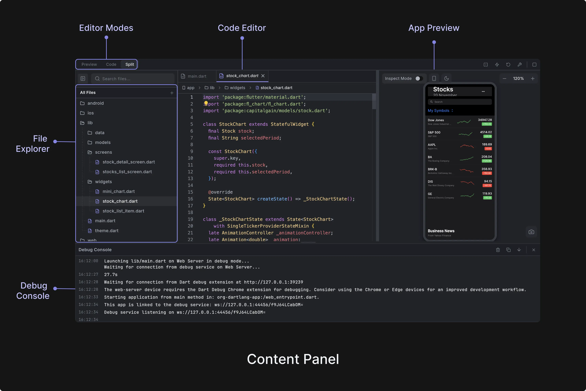
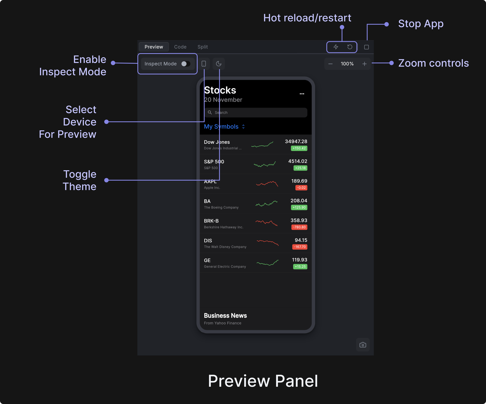
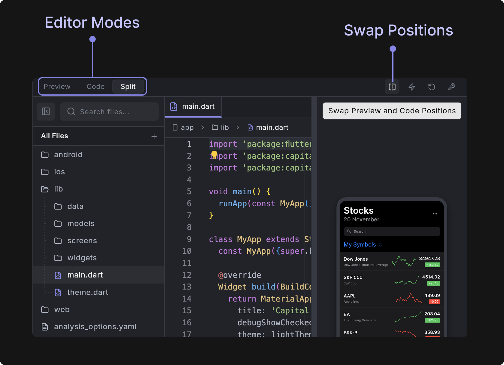

# Content Panel

The Content Panel is the central workspace area where you can view and edit your application code, preview your app, and access debugging information. It provides a comprehensive development environment with multiple views and tools to help you build and test your applications.



The Content Panel consists of three main sections that work together to provide a complete development experience:

- **App Preview**: The application is running in real-time for you to test any logic or UI changes quickly. 
- **Code Editor**: View and edit your Flutter app source code. 
- **Debug Console**: Monitor any debug or print information once you run the app.

:::info[Editor Modes]

The content panel integrates with three main editor modes accessible via the top toolbar:
- **Preview Mode**: Shows only the app preview. Ideal for focused visual development and testing.
- **Code Mode**: Displays only the Monaco code editor without preview. Perfect for intensive coding sessions.
- **Split Mode**: Shows both preview and code editor side-by-side with adjustable split ratio. Great for larger screens.
:::

## App Preview

The App Preview panel is the central component of Dreamflow's environment, providing real-time preview of Flutter applications with advanced inspection and editing capabilities.

The panel displays a real-time preview of your Flutter app running in **debug mode**, with instant updates as you make code changes. The preview runs in a WebView container and supports hot reload for immediate feedback during development.




### Inspect Mode
Inspect mode provides an interactive way to explore and modify your Flutter widgets visually. When enabled, hovering over widgets in the preview reveals their boundaries with colored overlays, making it easy to understand widget layout and hierarchy. This visual feedback helps developers quickly identify and understand the structure of their UI components. 

To turn on inspect mode, select the **Inspect Mode** toggle in the Content Panel canvas. 

Selecting a widget with a click automatically synchronizes the [Widget Tree](modules-panel/widget-panel.md) and [Property Panel](properties-panel.md) to display detailed information about that widget, maintaining the highlight until another selection is made. This seamless integration between the preview and development panels streamlines the workflow for analyzing and modifying widgets. The context menu, accessed through right-click, offers powerful widget-specific actions including property editing, adding context to agent, code navigation, and other operations, enabling rapid iterations on your Flutter application's user interface.

### Hot Reload, Hot Restart and Stop
Dreamflow provides integrated hot reload and hot restart capabilities that allow you to quickly test code changes without losing your development context. These essential Flutter development tools are accessible through dedicated buttons in the Content Panel toolbar.

**Hot Reload** applies your code changes instantly while preserving the current application state. This is ideal for UI modifications, styling updates, and minor code changes. To Hot Reload the preview, click the **lightning button** at the top of the Content Panel.

**Hot Restart** completely restarts your Flutter app with all code changes applied, resetting the application state. Use this for structural changes, when hot reload fails, or after fixing compilation errors. To Hot Restart the preview, click the **refresh** button at the top right of the Content Panel. 

**Stop Preview** ends the preview session completely. While Dreamflow works to prevent issues, sometimes the preview can enter an unusual or broken state. If problems aren’t resolved by Hot Reload or Hot Restart, it’s best to click the **Stop** button at the top of the Content Panel to stop the preview completely and restart it. Once stopped, you can restart the preview using the **Restart** button that appears on the preview device. 


### Additional Features

- **Multi-Device Preview**: Choose from four preview modes to test your app across different form factors (by selecting the device button in the Content Panel canvas):
    - Phone (iPhone 16 Pro Max - 390x844)
    - Tablet (iPad Pro 13" - 834x1194)
    - Desktop (1920x1080 landscape)
    - Expanded (full-width preview without device frame)


- **Interactive Zoom & Pan**: The preview supports zoom levels from 30% to 300% with smooth panning capabilities. Zoom preferences are automatically saved and restored between sessions.

- **Theme Support**: Use the App Brightness toggle (moon / sun button) on the Content Panel canvas to preview both light and dark themes for your app. 

## Code Editor

The Code Editor is located on the left side of the Content Panel and provides a powerful environment for writing and editing your Flutter code.

:::tip
You can swap the positions of the preview and code editor by clicking on the icon at the top right of your Content Panel.
<p></p>

:::

The Code editor is built on **Monaco Editor** (the same editor that powers VS Code) and provides a full-featured coding experience. It includes syntax highlighting, auto-completion, and IntelliSense for Dart/Flutter development. The editor supports multi-file editing with tabs, real-time collaboration features, and integrates seamlessly with the platform's live preview system. It also includes advanced right-click features like go-to-definition, find references, and code formatting that you'd expect from a professional IDE.

## Debug Console

The Debug Console is a dedicated output panel in Dreamflow that displays real-time logs and debug information from your Flutter application. This includes:

- [Print statements from your Dart code](#print-statements-from-your-dart-code)
- Flutter framework messages 
- Hot reload notifications
- Build process output
- Error messages and stack traces


<div style={{
    position: 'relative',
    paddingBottom: 'calc(50.67989417989418% + 41px)', // Keeps the aspect ratio and additional padding
    height: 0,
    width: '100%'}}>
    <iframe 
        src="https://demo.arcade.software/2wlNaYsMEfK9Ko4y9Bkt?embed&show_copy_link=true"
        title=""
        style={{
            position: 'absolute',
            top: 0,
            left: 0,
            width: '100%',
            height: '100%',
            colorScheme: 'light'
        }}
        frameBorder="0"
        loading="lazy"
        webkitAllowFullScreen
        mozAllowFullScreen
        allowFullScreen
        allow="clipboard-write">
    </iframe>
</div>
<p></p>

### Print Statements From Your Dart Code

You can use `print()` or `debugPrint()` in your code to send messages to the Debug Console. These print statements are helpful for tracking user actions, data updates, or debugging logic while your app runs in preview mode.

#### Quick Example

You can add a log message directly in code when a user taps the **Add Habit** button like this:

```dart
ElevatedButton(
  onPressed: () {
    // your existing logic here
    print('Habit Added');
  },
  child: Text('Add Habit'),
);
```


#### Other Examples

```dart
// Simple
print('HomePage built');

// Safer for long text (JSON, lists, etc.)
debugPrint('Fetched ${items.length} items: ${items.toString()}');

// With context
debugPrint('[Auth] Sign-in tapped for email=$email');

// Multi-line (debugPrint handles long lines gracefully)
debugPrint(jsonEncode(responseData));
```

#### Example Agent Prompt

You can use the Dreamflow Agent to automatically add print statements wherever required. Here’s a sample prompt:

```
Add a print statement to log habit status in debug console whenever its value changes.
```


:::tip

- Prefer `debugPrint` for long or multi-line content.
- **Never** log secrets such as access tokens and passwords.
- Add short **tags** (`[API]`, `[DB]`, `[Auth]`) so you can filter quickly.
- For more advanced logging with log levels, timestamps, and formatting, consider using the following Dart packages:
    - [**logging**](https://pub.dev/packages/logging): a lightweight logging framework from the Dart team.
    - [**logger**](https://pub.dev/packages/logger): a popular and feature-rich logger with colorful, structured output.
:::

## FAQs

<details> 

<summary> What should I do if the Preview is not loading and always shows "Preview starting…" message? </summary> 

<p> 

This usually happens when the preview session is stuck or the project dependencies need to be refreshed. Here are several steps you can try to resolve the issue:

- **Hot Reload (⚡):** Quickly applies code changes while keeping the current state. Use this first for small UI or logic updates.
- **Hot Restart (🔄):** Restarts the app and resets its state. Use this if hot reload doesn't reflect changes or the preview is still stuck.
- **Stop and Restart Preview (⏹️/▶️):** Manually stop the preview and start it again to relaunch the app.
- **Refresh Dependencies:** At the bottom toolbar, click **Refresh Dependencies**. This will re-sync all your pub.dev packages in case the issue is caused by outdated or missing dependencies.
- **Reload Project:** You can try to restart the project session entirely by selecting the project name in the top left corner and then selecting **Reload Project**.

- **Check for Errors in Debug Console:** Open the Debug Console from the bottom panel to look for errors or warnings that may be preventing the app from launching. If you spot an error, you can ask the Agent directly to help resolve it.

Most preview issues can be fixed by reloading the project or restarting the preview. If the problem continues, use the **Submit Feedback** button in the top bar to file a bug report.

</p> 

</details>

