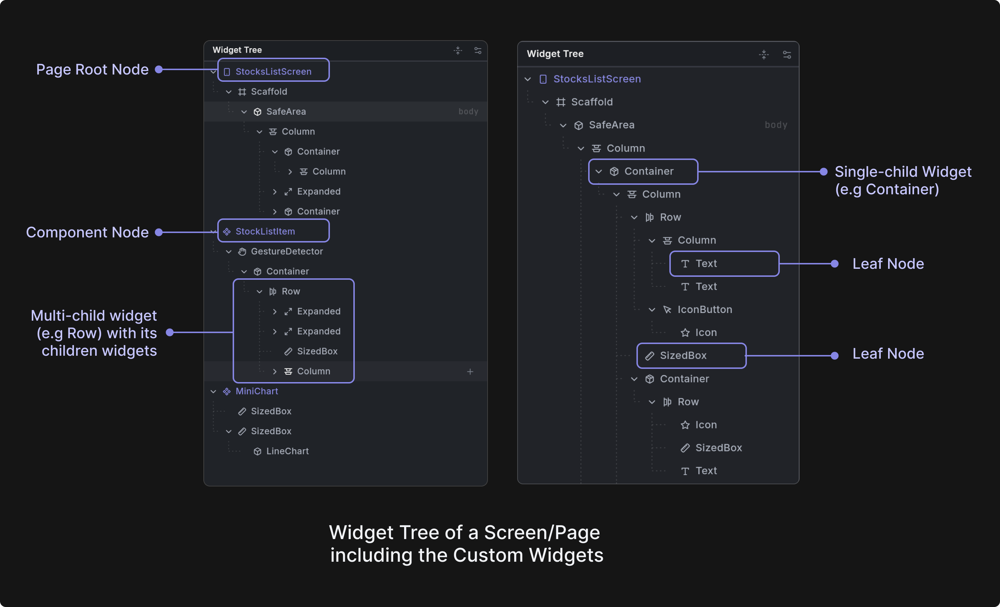
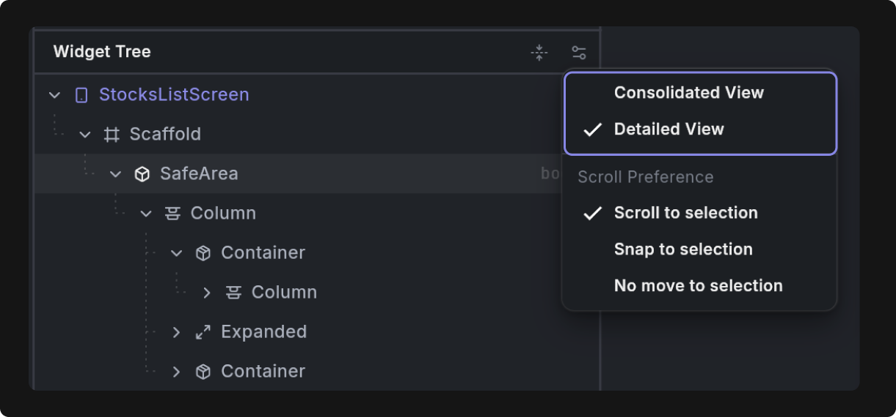

# Widget Tree

The Widget Tree panel is a hierarchical view that displays the structure of your app's interface. It's located in the left hand side panel, and can be opened by clicking the "Widget Tree" button from the left side rail.  

In Flutter, a widget is the basic building block of the UI - it describes what part of the inerface should look like and how it should behave. 

Widgets are composable, meaning you can building complex UIs by combining, or nesting widgets. 
A parent widget holds one or more child widgets to form the UI hierarchy. 

The widget tree in Dreamflow allows you to view the widgets that are currently rendered in the preview. 

**Hierarchical Tree View**: Displays your app's widget structure as an expandable tree, showing the parent-child relationships between widgets. Each node represents a widget with its type, properties, and children clearly visible.

**Widget Selection**: Click on any widget in the tree to select it. When you have **[Inspect Mode](/workspace/content-panel#inspect-mode)** turned on, you'll visually see the widget highlighted in the preview. Double clicking the widget in the widget tree also pulls up the **[Properties Panel](/workspace/properties-panel)** for the widget - allowing you to easily specify input parameters for the widget.

**Real-Time Synchronization**: The tree automatically updates in real-time as you make changes to your code, reflecting the current state of your running Flutter app.

## Nodes (Widgets)

**Nodes** are individual widgets in your Flutter app's hierarchy, displayed as tree items in the Widget Tree panel. Each node represents a widget instance configired with properties and relationships.

**Root Nodes**: Top-level widgets that represent entire screens or components.
- **Page Nodes**: Screens within your app. Specifically, widgets that use `Scaffold` or take up the entire width of the phone. In the Widget Tree, pages have a Page Icon and are shown in purple.
- **Component Nodes**: Reusable custom widgets that appear in the rendered screen. In the Widget Tree, component definitions are purple marked with a diamond icon when defined in their own class. Components created through functions or variables in code are also supported and are shown in purple with their own distinct icons.

**Child Nodes**: Widgets that contain other widgets
- **Single Child**: Widgets with exactly one child (e.g. `Container`)
- **Multiple Children**: Widgets with multiple children (e.g. `Column`, `Row`) or that have additional properties that take widgets as arguments (e.g. `Scaffold` has an `appBar` property and a `body` property, each take a widget as the input)

**Leaf Nodes**: Terminal widgets with no children such as `Text`, `Image`, `Icon`, `Button`. 

The tree structure helps you understand your app's widget hierarchy and navigate between different UI components.

:::info[View Modes]

You can change the *view* of the Widget Tree to be either Consolidated or Detailed by clicking on the toggle button at the top of the Widget Tree panel. 

**Consolidated View**: Hides structural widgets or Modifiers like `Expanded`, `Padding` to provide a cleaner, more focused view of your actual UI components.

**Detailed View**: Shows every widget in the tree, including all structural and layout widgets, giving you complete visibility into the widget hierarchy.

:::

## Widget Management

Right-click on any widget to access a comprehensive context menu with options for:
- [Adding new widgets](/workspace/widget-tree#add-widget)(to widgets that take other widgets as children or have properties that take a widget)
- Wrapping existing widgets
- Copying, cutting, and pasting widgets
- Navigating to component definitions
= Navigating to component references
- Removing widgets
- Navigating to the definition of the widget in code
- Adding the widget (and correspinding screenshot) as context to the agent chat (Add to Agent)
- Doing a quick AI-fueled edit of the widget using the agent (Prompt Edit)

:::tip[Collapse / Expand all]
Sometimes you need to quickly take stock of the different pages and components in your application. You can use the Expand / Collapse button at the top of the Widget Tree panel to quickly expand or collapse all widgets within the tree.
:::

### Add Widget
Insert new widgets into your tree by selecting a parent widget, clicking the plus (add) button, and choosing from a categorized catalog of available widgets (Framework, Project, Dependencies). For structural widgets like Scaffold, you will see a list of property-specific widgets that can be added as children.

- **Framework widgets** are widgets imported directly from the Flutter framework, or the Material and Cupertino Flutter Libraries
- **Project widgets** are widgets (custom components) defined within the project
- **Dependency widgets** are widgets imported from packages

    <iframe 
        src="https://demo.arcade.software/Xb10bs310XYTGNS6Uf1H?embed&show_copy_link=true"
        title=""
        style={{
            position: 'absolute',
            top: 0,
            left: 0,
            width: '100%',
            height: '100%',
            colorScheme: 'light'
        }}
        frameBorder="0"
        loading="lazy"
        webkitAllowFullScreen
        mozAllowFullScreen
        allowFullScreen
        allow="clipboard-write">
    </iframe>

Here’s a quick demo showing how you can add a widget to a Column:

    <iframe 
        src="https://demo.arcade.software/3eXOPIUfeFG3StCJv5H4?embed&show_copy_link=true"
        title=""
        style={{
            position: 'absolute',
            top: 0,
            left: 0,
            width: '100%',
            height: '100%',
            colorScheme: 'light'
        }}
        frameBorder="0"
        loading="lazy"
        webkitAllowFullScreen
        mozAllowFullScreen
        allowFullScreen
        allow="clipboard-write">
    </iframe>

:::tip[Right-Click to Add Widget]
For quick access to widget options, right-click on any existing widget to open the context menu. This provides an alternative way to add new widgets to your layout.
:::

### Dragging and Dropping Widgets 
You can drag and drop widgets within the Widget Tree to change the order of widgets in the tree and within your screen. Simply select a widget and drag it into a new place in the Widget Tree. 

<!-- TO DO: add arcade -->

### Wrap Widget
Wrap existing widgets with containers, padding, or other layout widgets to modify their behavior without changing their core functionality.

To wrap a widget, right click and select "Wrap Widget." Then select a widget to wrap with. 

    <iframe 
        src="https://demo.arcade.software/2Hdtm30YQkY9xy4zFhKv?embed&show_copy_link=true"
        title=""
        style={{
            position: 'absolute',
            top: 0,
            left: 0,
            width: '100%',
            height: '100%',
            colorScheme: 'light'
        }}
        frameBorder="0"
        loading="lazy"
        webkitAllowFullScreen
        mozAllowFullScreen
        allowFullScreen
        allow="clipboard-write">
    </iframe>

### Jumping to Component Definitions and References
When building your application, you may want to see where custom components are defined or referenced. For example, you can right click instances of components (denoted using the component icon) and click "See Definition" to jump to the definition of that component in the Widget Tree. 

To see references, or usages, of a component, right click on the component and select "See References." This allows you to step through each of the references within the Widget Tree.

<!-- TO DO: add arcade -->

### Clipboard Operations
Right clicking on a widget in the Widget Tree also provides standard clipboard operations (cut, copy, paste) that allow you to move and duplicate widgets across your layout tree. You can use either the context menu options or familiar keyboard shortcuts:

- **Cut**: Ctrl/Cmd + X
- **Copy**: Ctrl/Cmd + C  
- **Paste**: Ctrl/Cmd + V

These operations enable efficient widget reuse and layout restructuring without having to recreate widgets from scratch.

### Go to Code
The "Go to Code" features provide quick navigation from the Widget Tree to the underlying [code implementation](../content-panel.md#code-editor). You can access these features by hovering over a widget in the tree and right-clicking on the widget and selecting "Go to Code".

 
