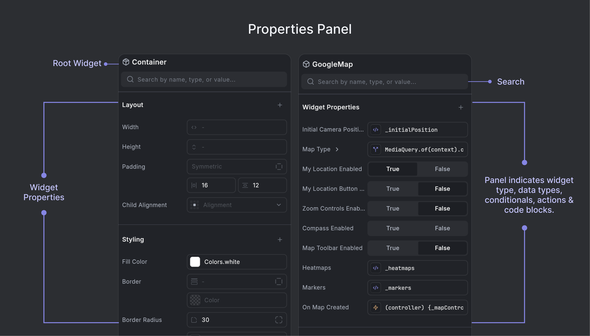

# Properties Panel 

The Properties Panel allows you to edit widget properties in real-time, providing both easy-to-use visual editors and flexible code-based editing capabilities.

    <iframe 
        src="https://demo.arcade.software/ylwlUjH3jbhrogoB0riK?embed&show_copy_link=true"
        title=""
        style={{
            position: 'absolute',
            top: 0,
            left: 0,
            width: '100%',
            height: '100%',
            colorScheme: 'light'
        }}
        frameBorder="0"
        loading="lazy"
        webkitAllowFullScreen
        mozAllowFullScreen
        allowFullScreen
        allow="clipboard-write">
    </iframe>

:::tip[Quick Access from Widget Tree]
The Properties Panel can be quickly accessed by double clicking any widget in the Widget Tree. The panel will automatically update to show the properties of the selected widget.
:::

The Properties Panel consists of several key surface elements that help you navigate and edit widget properties:

**Root Widget Name**: At the top of the Properties Panel, you'll see the root icon and name for the selected widget (e.g., a cube icon for Container, a map icon for GoogleMap). This visual identifier helps you quickly recognize which widget you're currently editing.

**Search**: The search bar at the top of the panel allows you to quickly find properties by name, type, or value.

**Widget Properties**: The main section displays all properties for the selected widget, organized by type. See [Property Types](#property-types) for details on different property types and their indicators.

**Modifiers**: At the bottom of the Properties Panel, you can add wrapper widgets to modify behavior, appearance, or layout. See [Modifiers](#modifiers) for detailed information.

## Property Types

The Properties Panel supports various property types, each with specialized editors and visual indicators. Properties are marked with icons that indicate their type and how you can interact with them.

### Common Property Types

The panel supports a wide range of property types including:
- **Text** - String values and text content
- **Numbers** - Numeric values for dimensions, spacing, etc.
- **Colors** - Color pickers for backgrounds, borders, text colors
- **Icons** - Icon selectors and custom icon properties
- **Images** - Image selectors and asset management
- **Widgets** - Child widgets and widget references
- **Booleans** - Toggle switches for true/false values
- **Lists/Arrays** - Collections of items (columns, rows, etc.)
- **Enums** - Dropdown selections for predefined options

Each property type has its own specialized editor optimized for that data type, making it easy to configure widgets without writing code.

**Example**

For example, here's how the Properties Panel appears when editing a Container widget:

    <iframe 
        src="https://demo.arcade.software/CFMeS9Pvdklc5IiJAoPV?embed&show_copy_link=true"
        title=""
        style={{
            position: 'absolute',
            top: 0,
            left: 0,
            width: '100%',
            height: '100%',
            colorScheme: 'light'
        }}
        frameBorder="0"
        loading="lazy"
        webkitAllowFullScreen
        mozAllowFullScreen
        allowFullScreen
        allow="clipboard-write">
    </iframe>

#### Adding Additional Properties

Some properties for widgets are hidden by default. However, any property that's accessible in the underlying widget can be set from the property panel. If you are looking for a property that's not currently visible, you can search for it or add it using the **+ Add Property** button at the top of the Property panel.

    <iframe 
        src="https://demo.arcade.software/teMRY5B8qPfkeYrHwYRd?embed&show_copy_link=true"
        title=""
        style={{
            position: 'absolute',
            top: 0,
            left: 0,
            width: '100%',
            height: '100%',
            colorScheme: 'light'
        }}
        frameBorder="0"
        loading="lazy"
        webkitAllowFullScreen
        mozAllowFullScreen
        allowFullScreen
        allow="clipboard-write">
    </iframe>

### Conditional Values

Properties that use conditional values are indicated by a branching icon (resembling a "Y" with arrows). These allow you to set different property values based on runtime conditions.

When working with conditional values, you can:
- Set up conditions using any valid Dart expression
- Define different values for the true and false branches
- Use any property type (widgets, colors, numbers, strings, etc.) in each branch
- Nest conditions for more complex logic

This feature is especially powerful for creating dynamic UIs that respond to state changes, user interactions, or other runtime conditions.

    <iframe 
        src="https://demo.arcade.software/2Vp9gL1oT72EL2o6kx8o?embed&show_copy_link=true"
        title=""
        style={{
            position: 'absolute',
            top: 0,
            left: 0,
            width: '100%',
            height: '100%',
            colorScheme: 'light'
        }}
        frameBorder="0"
        loading="lazy"
        webkitAllowFullScreen
        mozAllowFullScreen
        allowFullScreen
        allow="clipboard-write">
    </iframe>

### Action Functions

Properties that represent actions or callbacks (such as `onPressed`, `onTap`, `onMapCreated`) are marked with action icons like a lightning bolt (⚡) or parentheses `()`. These indicate interactive behaviors that can be configured with event handlers or function calls.

You can click on these properties to open the code editor and define the function that will be called when the action is triggered.

    <iframe 
        src="https://demo.arcade.software/Z4dbFaIdPdz4g27FIUg5?embed&show_copy_link=true"
        title=""
        style={{
            position: 'absolute',
            top: 0,
            left: 0,
            width: '100%',
            height: '100%',
            colorScheme: 'light'
        }}
        frameBorder="0"
        loading="lazy"
        webkitAllowFullScreen
        mozAllowFullScreen
        allowFullScreen
        allow="clipboard-write">
    </iframe>

### Code Blocks or Variables

Properties that represent variables or code expressions (rather than actions or functions) are indicated with a code block icon (`</>`).

This icon highlights that the property's value is set via a variable or code rather than a simple constant or selection. Clicking this property will allow you to edit the associated code expression.

    <iframe 
        src="https://demo.arcade.software/kGqhA6rT9voqoi4Xrxl2?embed&show_copy_link=true"
        title=""
        style={{
            position: 'absolute',
            top: 0,
            left: 0,
            width: '100%',
            height: '100%',
            colorScheme: 'light'
        }}
        frameBorder="0"
        loading="lazy"
        webkitAllowFullScreen
        mozAllowFullScreen
        allowFullScreen
        allow="clipboard-write">
    </iframe>

#### Switching to Quick Code Viewer
To switch from the visual property editor to a code-based property editor, hover near the property and click the "Switch to Code View" button. You can also cmd+click this button to jump to the specific line in the code editor where the property is defined.

    <iframe 
        src="https://demo.arcade.software/3VzSt8gjrJw5tGwlIZFX?embed&show_copy_link=true"
        title=""
        style={{
            position: 'absolute',
            top: 0,
            left: 0,
            width: '100%',
            height: '100%',
            colorScheme: 'light'
        }}
        frameBorder="0"
        loading="lazy"
        webkitAllowFullScreen
        mozAllowFullScreen
        allowFullScreen
        allow="clipboard-write">
    </iframe>

## Constructors

Many Flutter widgets support multiple constructors, each with different parameter sets. Constructors are different ways to initialize a widget:
- **Default constructor**: The standard way to create a widget with all properties available
- **Named constructors**: Often provide convenient shortcuts or specific configurations
  - For example, `Container()` vs `Container.fromLTRB()` for setting left, top, right, bottom values
  - Or `EdgeInsets.all()` vs `EdgeInsets.symmetric()` vs `EdgeInsets.only()` for padding

When you switch constructors, the Properties Panel will update to show only the properties relevant to that specific constructor, making it easier to configure the widget for your specific use case.

### Switch Constructors

1. Select a widget in the Widget Tree or Canvas
2. In the Properties Panel, locate the **Constructor** section at the top
3. Click on the constructor dropdown (typically showing "Default" or the current constructor name)
4. Select a different constructor from the available options

    <iframe 
        src="https://demo.arcade.software/nfpojRUhatIg69DuLsrM?embed&show_copy_link=true"
        title=""
        style={{
            position: 'absolute',
            top: 0,
            left: 0,
            width: '100%',
            height: '100%',
            colorScheme: 'light'
        }}
        frameBorder="0"
        loading="lazy"
        webkitAllowFullScreen
        mozAllowFullScreen
        allowFullScreen
        allow="clipboard-write">
    </iframe>

:::tip[Constructor-Specific Properties]
Some properties may only be available with certain constructors. If you don't see a property you need, try switching to a different constructor that supports it.
:::

## Modifiers

Modifiers refer to wrapper widgets that can be added around existing Flutter widgets to modify their behavior, appearance, or layout. Think of them as "decorators" that wrap around your base widgets. They are Flutter widgets that wrap around other widgets to modify their:
- **Layout behavior** (positioning, sizing, constraints)
- **Visual appearance** (colors, borders, shadows, opacity)
- **Interactive behavior** (gestures, focus, accessibility)
- **Animation properties** (transitions, transformations)

:::note[Modifiers in the Widget Tree]
Modifier widgets are hidden from the "Simplified View" in the [**widget tree**](modules-panel/widget-panel.md#nodes-widgets).
:::

### Adding a Modifier

1. Select any widget in the Widget Tree Panel that you want to wrap with a **Modifier** widget.

2. In the Properties Panel, scroll down to the **Modifiers** section at the bottom.

3. Click the **+** button next to "Modifiers" tab to open the Modifier selection menu.

4. Choose from available wrapper widgets such as:
    - **Container** - For padding, margin, decoration, and constraints
    - **Padding** - For adding space around content
    - **Center** - For centering content
    - **Align** - For positioning content
    - **SizedBox** - For setting specific dimensions
    - **Transform** - For rotations, scaling, and translations & other such modifier widgets. 

5. The Modifier widget will be added to your widget hierarchy and its properties will appear in the Modifiers tab section of the Properties panel, where you can edit them immediately.

    <iframe 
        src="https://demo.arcade.software/NTeLIjTN1QAfLyyx4BVB?embed&show_copy_link=true"
        title=""
        style={{
            position: 'absolute',
            top: 0,
            left: 0,
            width: '100%',
            height: '100%',
            colorScheme: 'light'
        }}
        frameBorder="0"
        loading="lazy"
        webkitAllowFullScreen
        mozAllowFullScreen
        allowFullScreen
        allow="clipboard-write">
    </iframe>

